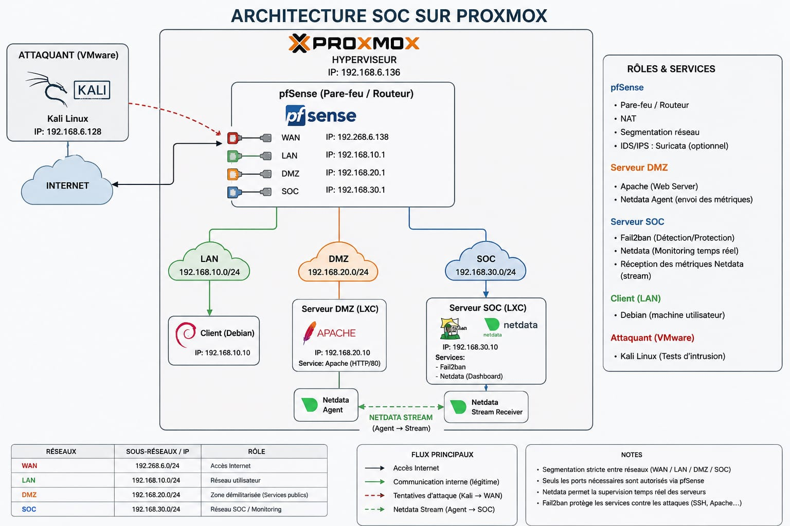

# Architecture SOC et Segmentation Réseau sur Proxmox VE
Ce projet présente la mise en œuvre d'une architecture réseau sécurisée et d'un mini Security Operations Center (SOC) virtualisé sous l'hyperviseur **Proxmox VE**. L'objectif est de segmenter les flux réseau à l'aide d'un pare-feu virtuel (**pfSense**), d'héberger des services exposés et internes, et de mettre en place une solution de supervision en temps réel (**Netdata**) ainsi qu'une protection active (**Fail2ban**) contre les attaques simulées depuis une machine externe (**Kali Linux**).

## 🔍 Aperçu de l'Architecture

L'infrastructure est entièrement virtualisée sur un hyperviseur **Proxmox VE** (IP : `192.168.6.136`). Le cœur du routage et de la sécurité est confié à une machine virtuelle **pfSense** qui interconnecte quatre zones distinctes (WAN, LAN, DMZ, SOC).

### Schéma Conceptuel

* **Attaquant Extérieur** (VMware / Kali Linux) → Attaque le **WAN** (pfSense)
* **pfSense** → Filtre et distribue les flux vers le **LAN**, la **DMZ** et le **SOC**
* **Serveur DMZ** → Héberge un serveur web Apache surveillé
* **Serveur SOC** → Centralise les métriques de performance et supervise l'activité
* **Client LAN** → Machine utilisateur standard pour les accès légitimes

---

## 🌐 Plan d'Adressage IP & Segmentation

La segmentation est configurée via des interfaces distinctes portées par le pare-feu pfSense :

| Zone Réseau | Sous-réseau / IP CIDR | IP Interface pfSense | Rôle / Description |
| :--- | :--- | :--- | :--- |
| **WAN** | `192.168.6.0/24` | `192.168.6.138` | Accès Internet / Interface externe exposée |
| **LAN** | `192.168.10.0/24` | `192.168.10.1` | Réseau utilisateur interne et de confiance |
| **DMZ** | `192.168.20.0/24` | `192.168.20.1` | Zone Démilitarisée (Services accessibles publics) |
| **SOC** | `192.168.30.0/24` | `192.168.30.1` | Réseau SOC / Monitoring et supervision |

---

## 🛠️ Rôles et Services des Composants

### 1. Pare-feu / Routeur : pfSense
* **Fonctions principales :** Pare-feu, Routage inter-VLAN, NAT (Network Address Translation), et Segmentation réseau.
* **Sécurité additionnelle :** Possibilité d'intégrer un système d'IDS/IPS comme *Suricata* (optionnel) pour la détection d'intrusions au niveau de la passerelle.

### 2. Client (LAN)
* **Composant :** Machine utilisateur sous Debian (VM ou conteneur).
* **Adresse IP :** `192.168.10.10`
* **Rôle :** Représente un poste client légitime au sein du réseau d'entreprise.

### 3. Serveur DMZ (Conteneur LXC)
* **Adresse IP :** `192.168.20.10`
* **Services activés :**
  * **Apache (Web Server) :** Serveur HTTP écoutant sur le port 80 pour héberger le site ou l'application web publique.
  * **Netdata Agent :** Collecte en temps réel les métriques de performance du serveur et assure l'envoi des flux (*stream*) vers le serveur SOC.

### 4. Serveur SOC (Conteneur LXC)
* **Adresse IP :** `192.168.30.10`
* **Services activés :**
  * **Netdata Stream Receiver & Dashboard :** Centralise la réception des métriques provenant de la DMZ pour une visualisation en temps réel sur tableau de bord.
  * **Fail2ban (Détection/Protection) :** Analyse les logs système et applicatifs afin de détecter les comportements malveillants et d'appliquer un bannissement dynamique des IP malveillantes.

### 5. Attaquant (VMware)
* **Composant :** Système d'exploitation Kali Linux.
* **Adresse IP :** `192.168.6.128`
* **Rôle :** Machine externe dédiée aux tests d'intrusion et simulations d'attaques orientées vers la surface WAN de la topologie.

---

## 🔀 Flux Réseau et Communications

L'infrastructure s'appuie sur quatre types de flux majeurs, strictement contrôlés par pfSense :

1. **Accès Internet :** Flux sortants pour les mises à jour et accès web légitimes.
2. **Communication Interne (Légitime) :** Flux d'administration ou d'accès autorisés entre les réseaux locaux.
3. **Tentatives d'Attaque (Kali ➔ WAN) :** Flux offensifs simulés ciblant les infrastructures à travers l'interface externe du pare-feu.
4. **Netdata Stream (Agent DMZ ➔ Stream Receiver SOC) :** Flux de monitoring continu permettant d'acheminer les métriques de la DMZ vers le réseau SOC de manière isolée.

---

## 🔒 Scénarios de Sécurité et Simulation d'Attaque

### Scénario A : Supervision en Temps Réel
L'**Agent Netdata** de la DMZ pousse ses métriques système en continu vers le **SOC**. En cas de pic de charge ou d'anomalie réseau sur le serveur Apache, l'administrateur peut l'identifier instantanément sur le Dashboard centralisé du SOC.

### Scénario B : Attaque et Protection Active
1. La machine **Kali Linux** initie une attaque (ex: force brute SSH ou scan agressif sur le serveur Apache).
2. **Fail2ban** sur le serveur SOC analyse l'activité anormale ou les échecs d'authentification à travers les logs collectés.
3. **Fail2ban** applique automatiquement une règle de blocage pour protéger les services (SSH, Apache...) contre l'adresse IP de l'attaquant.

---

## 📌 Notes de Configuration & Bonnes Pratiques

* **Segmentation stricte :** Les flux entre les réseaux (WAN / LAN / DMZ / SOC) sont hermétiques par défaut.
* **Moindre privilège :** Seuls les ports strictement nécessaires aux applications (ex: Port 80 pour Apache) sont explicitement autorisés via pfSense.
* **Supervision isolée :** L'usage du streaming Netdata garantit que le tableau de bord de supervision n'est pas exposé directement sur internet ou dans la zone publique (DMZ).
